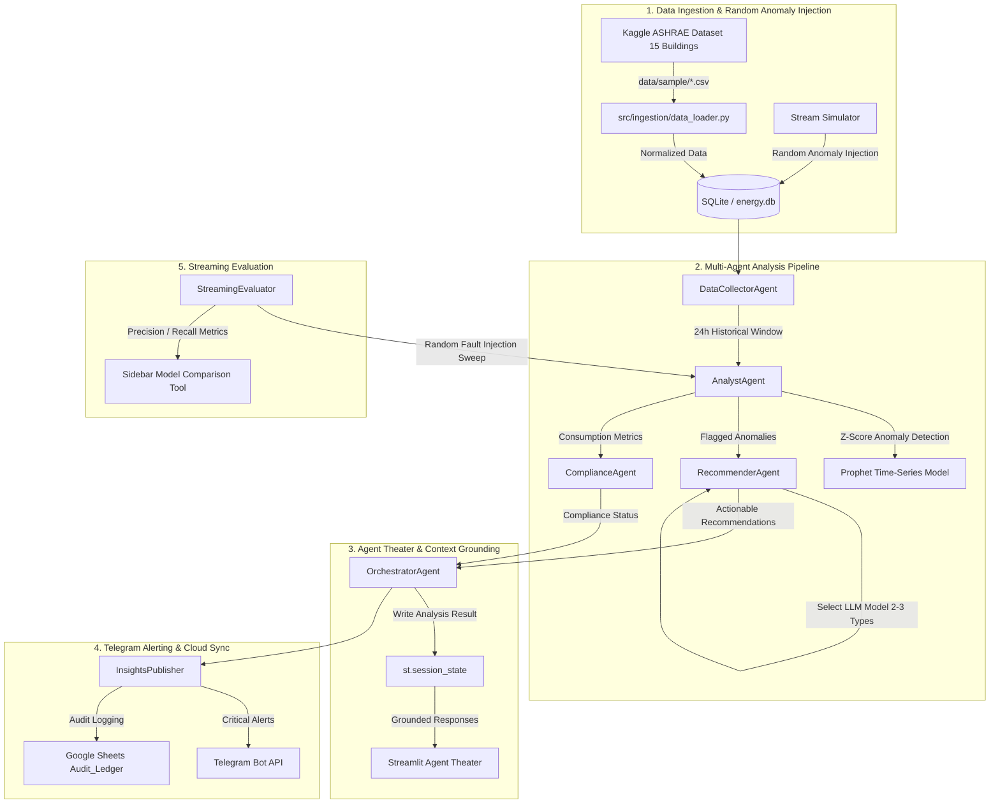

# EcoSense-AI

# EcoSense LG — AI-Powered Energy Operations Cockpit


[](https://www.python.org/)
[](https://streamlit.io/)
[](https://ollama.ai/)
[](LICENSE)


EcoSense-AI is a modern, opinionated, Streamlit-based interface for energy monitoring, anomaly detection, recommendation generation, and automation. It combines simulated building energy streams, a local Ollama-backed agent theater, Telegram alerts, and Google Sheets persistence to turn raw energy data into actions.

No cloud lock-in. No black-box servers. Your building data stays local — EcoSense-AI is the cockpit.


## 1. Project Description


**EcoSense LG** is an AI-powered, privacy-first energy management and decision-support cockpit designed for building owners, facility managers, and energy operators. It transforms raw building consumption data into real-time operational insights, anomaly alerts, and actionable recommendations.

### The Problem
Traditional Building Energy Management Systems (BEMS) rely on static spreadsheets or rigid rule-based alerts that generate excessive false alarms or fail to provide actionable context when energy anomalies occur.

🚀 Why EcoSense-AI
=======
### The Solution
EcoSense LG combines real-world building telemetry, statistical anomaly detection, time-series forecasting, multiple Large Language Model (LLM) backends, and instant multi-channel alerting. EcoSense LG ingests energy readings, injects random real-time anomalies for testing, orchestrates a multi-agent analysis flow, presents transparent reasoning inside a Streamlit Agent Theater, and pushes critical alerts to Telegram and Google Sheets.
>>>>>>> 6ccb26a (Several updates in data processing)

### 📌 Dataset Origin & Benchmark Note
All baseline building energy consumption data under the `data/sample/` directory (`ecosense_train_hourly.csv`, `ecosense_metadata.csv`) are collected directly from the **Great ASHRAE Energy Predictor III Competition** on the **Kaggle platform**. A curated sample of **15 buildings** (spanning Office, Education, Lodging/Residential, Public Services, Entertainment, and Religious Worship use types) was selected to represent realistic multi-building energy streams for simulation and testing.


EcoSense-AI fixes the operations workflow without inventing a new data source.

Legacy energy tooling    | EcoSense-AI
------------------------|-------------------------------------------------
Static CSV reports      | Live simulation + real-time dashboards
Manual anomaly rules    | Multi-agent anomaly detection with local LLM
Delayed recommendations | Proactive energy-saving actions and alerts
Siloed integrations     | Telegram + Google Sheets + local LLM in one system
UI for operators        | Streamlit cockpit with agent theater and reports
=======
---

## 2. Features and Functionality

EcoSense LG is organized into core functional modules:

### ⚡ Data Ingestion & Random Anomaly Simulation
- **Kaggle ASHRAE Dataset Integration**: Standardizes and ingests hourly energy meter readings and building metadata for 15 selected facilities from the Kaggle ASHRAE competition.
- **Random Anomaly Injection**: Simulates real-world operational faults by randomly injecting energy spikes and dips into the data stream at configurable probability rates.
- **Statistical Digital Twin**: Applies rolling 20-sample window statistics and z-score deviation checks to establish normal consumption baselines and detect abnormal usage patterns.

### 🧠 Multi-LLM Insight Generation
- **Support for 2–3 LLM Types**: Integrates multiple local and open-source LLM options, including local Ollama models (`llama3.2:1b`, `qwen-7b`, `mistral-7b`) and Hugging Face PyTorch models (`distilgpt2`, `gpt2`).
- **Domain-Specific Recommendations**: Synthesizes complex anomaly data into human-readable, prioritized operational insights and energy-saving action plans.

### 🎭 Multi-Agent Theater & Context Grounding Engine
- **Specialized Agent Network**:
  - **DataCollectorAgent**: Validates and prepares historical 24-hour telemetry streams.
  - **AnalystAgent**: Executes statistical anomaly checks and time-series forecasting.
  - **RecommenderAgent**: Generates energy optimization advice using selected LLM backends.
  - **ComplianceAgent**: Checks consumption against building performance guidelines.
  - **OrchestratorAgent**: Coordinates parallel agent tasks and pipeline status.
- **Grounded Chatbot Interface**: Embedded operator assistant bound directly to `st.session_state["latest_analysis_result"]`, featuring fallback guards against ungrounded responses, low-quality echo rejection, and provenance tracking tags (`source: issues=N, actions=M`).

### 🔮 Predictive Maintenance & Time-Series Forecasting
- **Prophet Failure Horizon Modeling**: Predicts long-term energy consumption trends, estimates potential failure horizons, and categorizes maintenance priority (*Routine*, *Preventive*, *Urgent*, *Emergency*).

### 📲 Telegram Alerting & Google Sheets Synchronization
- **Telegram Bot Integration**: Sends instant, high-priority alert notifications (building ID, anomaly severity, recommended action) directly to operators' mobile devices via Telegram.
- **Google Sheets Audit Ledger**: Automatically appends detailed records of detected anomalies, recommendations, and execution status to a central `Audit_Ledger` tab.

### 📊 Streaming Evaluation & Model Comparison
- **`StreamingEvaluator` Framework**: Runs quantitative evaluation sweeps over streaming telemetry with random fault injection to compute Precision, Recall, F1-Score, ROC-AUC, and latency (<50ms).
- **Interactive Sidebar Tool**: Allows operators to benchmark detector sensitivity across custom thresholds and sample sizes.

### 💻 Streamlit Cockpit UI
- Modern dashboard equipped with live metric cards, consumption charts, building selection dropdowns, simulation speed controls, and agent thought logs.

---

## 3. Tools Used

EcoSense LG is built using a modern Python-centric software stack:

| Category | Technology / Library | Purpose & Role |
| :--- | :--- | :--- |
| **Core Language & Environment** | Python 3.8+ | Main programming language used across data pipelines, agents, and analytics. |
| **User Interface** | Streamlit 1.30+ | Interactive web cockpit, sidebar controls, building selection, and Agent Theater. |
| **Data Processing & Analytics** | Pandas, NumPy, Scikit-learn | Data manipulation, Kaggle dataset loading, standardization, and z-score calculations. |
| **Large Language Models (LLMs)** | Ollama (`llama3.2:1b`, `qwen-7b`, `mistral-7b`), Hugging Face Transformers (`distilgpt2`) | Multi-model local LLM integration for generating energy recommendations and answering operator queries. |
| **Predictive Modeling** | Meta Prophet | Time-series forecasting for energy usage trends and predictive maintenance scheduling. |
| **Database & Storage** | SQLite (`energy.db`), SQLAlchemy 2.0+ | Local storage for sensor readings, building profiles, and simulation states. |
| **Alerting & Cloud Sync** | Telegram Bot API (`requests`), Google Sheets API (`gspread`) | Real-time mobile alert notifications and cloud audit log persistence (`Audit_Ledger`). |
| **Testing & Benchmarking** | Pytest, Custom `StreamingEvaluator` | Automated unit testing, grounding validation, and streaming performance benchmarks. |

---

## 4. My Contribution and Learning as a CS Student

As a Computer Science student, building **EcoSense LG** provided hands-on experience in software engineering, applied AI, statistical data analysis, and distributed messaging.

### My Key Contributions

1. **Kaggle Dataset Processing & Pipeline Implementation**:
   - Analyzed and integrated real-world building energy data from the **Great ASHRAE Energy Predictor III Kaggle Competition**.
   - Selected **15 representative buildings** across diverse building categories (Office, Education, Lodging, etc.) under `data/sample/`.
   - Developed `src/ingestion/data_loader.py` to standardize timestamp formats, energy meter readings, and building metadata (`area_sqft`, primary use).

2. **Random Anomaly Injection Engine**:
   - Engineered the simulation engine (`src/services/simulator.py`) capable of streaming hourly energy data and injecting random anomaly faults (spikes/dips) based on configurable probability thresholds.
   - Enabled robust stress testing of anomaly detection algorithms under unpredictable data conditions.

3. **Multi-LLM Integration (2–3 Model Options)**:
   - Configured flexible LLM backend support (`src/llm/client.py`) allowing the system to toggle between local Ollama models (`llama3.2:1b`, `qwen-7b`, `mistral-7b`) and fine-tuned PyTorch/Hugging Face models (`distilgpt2`).
   - Designed structured prompt templates to extract clean, actionable maintenance advice from LLM outputs.

4. **Agent Theater Grounding & Anti-Hallucination Wiring**:
   - Addressed LLM hallucination by wiring the Streamlit chat assistant directly to live session analysis results stored in `st.session_state["latest_analysis_result"]`.
   - Implemented fallback logic for uninitialized context, echo-detection filters, and provenance tags (`source: issues=N, actions=M`) to ensure every response is backed by empirical data.

5. **Automated Telegram Bot Alerting Service**:
   - Built the `InsightsPublisher` and `TelegramBot` integration to dispatch instant critical alerts to facility managers' mobile devices whenever high-severity anomalies are detected.

6. **Streaming Benchmark & Performance Evaluation**:
   - Implemented `src/evaluation/streaming_evaluator.py` to evaluate anomaly detection metrics (Precision, Recall, F1-Score, Latency) over 900 streamed records across multiple runs.
   - Achieved a high-precision baseline (**99.1% Precision**), minimizing false alarms for operational staff.

---

### Key CS Learnings & Engineering Takeaways

- **Applied LLM Engineering & Grounding**: Learned how to control LLM generation temperature, prevent hallucinations in domain-specific applications, and ground model responses in real-time execution state.
- **Data Engineering with Real Competitions**: Gained practical skills in data cleaning, schema normalization, and missing-value handling using Kaggle competition datasets.
- **Asynchronous Microservice Architecture**: Understood how to decouple streaming simulators, SQLite relational databases, multi-agent orchestrators, external REST APIs (Telegram/Google), and web dashboards.
- **Statistical Anomaly Detection Trade-offs**: Learned the practical trade-offs between High Precision (reducing operator false alarm fatigue) and High Recall (catching every minor fault) in safety-critical industrial settings.
- **Full-Stack AI Application Development**: Experience bridging backend data science pipelines with interactive frontend user interfaces using Streamlit.

---

## 5. Project Workflow

The end-to-end operational workflow of EcoSense LG follows these sequential stages:



### Step-by-Step Execution Flow

1. **Data Loading & Simulation**:
   Hourly energy readings for 15 selected buildings from the Kaggle Great ASHRAE Energy Predictor III dataset are loaded into SQLite. The simulator streams readings while injecting random energy consumption anomalies.

2. **Multi-Agent Processing**:
   - `DataCollectorAgent` gathers the active telemetry window.
   - `AnalystAgent` calculates z-scores and feeds trends to the `Prophet` time-series model.
   - `RecommenderAgent` queries the active LLM model (`llama3.2:1b`, `qwen-7b`, `mistral-7b`, or `distilgpt2`) to generate targeted recommendations.
   - `ComplianceAgent` checks regulatory thresholds.

3. **Context Grounding in Agent Theater**:
   - `OrchestratorAgent` compiles outputs into `st.session_state["latest_analysis_result"]`.
   - The **Agent Theater** displays agent reasoning steps and answers user queries using strict grounding fallbacks and provenance markers.

4. **Alerting & Publishing**:
   - High-severity anomalies trigger real-time messages via the `TelegramBot`.
   - Detailed recommendation logs write asynchronously to the Google Sheets `Audit_Ledger`.

5. **Streaming Benchmarking**:
   - The `StreamingEvaluator` benchmarks detector precision, recall, and latency under synthetic fault injection runs.

---

## 🚀 Quick Start Guide

### Prerequisites
- Python 3.8+
- [Ollama](https://ollama.ai/) (optional, for local Ollama LLMs)

### Setup & Execution


git clone https://github.com/NSR123456/EcoSense-AI.git
cd "EcoSense-AI"

# 1. Clone the repository
git clone https://github.com/NSR123456/ecosense-lg.git
cd "EcoSense LG"

# 2. Create and activate a virtual environment

python -m venv .venv
.\.venv\Scripts\activate

# 3. Install dependencies
pip install -r requirements.txt

# 4. Pull local LLM model via Ollama (optional)
ollama pull llama3.2:1b

# 5. Launch the Streamlit Cockpit
streamlit run dashboard/app.py


### Running Tests & Evaluation


💡 No Telegram or Google Sheets configured? Complete the configuration in codebase .env file.

🔧 Configuration

Variable | Required | Purpose
--------|----------|--------
`TELEGRAM_TOKEN` | Yes | Telegram bot API token for alerts and control
`MY_CHAT_ID` | Yes | Chat ID to send alerts to
`GOOGLE_SHEET_ID` | Yes | Google Sheets document ID for data sync
`GOOGLE_APPLICATION_CREDENTIALS` | Yes | Path to service account JSON for Google Sheets
`OLLAMA_MODEL` | Yes | Ollama model name to use (default: `llama3.2:1b`)

All runtime configuration is read from `.env` or environment variables at startup.

🔀 Data sources

EcoSense-AI works with local sample data, Google Sheets, and optional SQL-backed sources.

Mode | Reads | Writes | When to use
-----|-------|--------|-----------
Sample data | CSV / in-memory | N/A | Local demos and testing
Google Sheets | Sheets API | Sheets API | Cloud persistence for reports and logs
Telegram | N/A | Telegram API | Operator alerts and manual control

Sample datasets live under `data/sample/` so you can get started without external dependencies.

🧠 Local LLM

The system uses Ollama locally for agent reasoning. That means your analysis stays on-premise and does not depend on an external LLM service.

🏗 Architecture

```
BROWSER / Streamlit UI
├─ dashboard/app.py
│  ├─ ui/                # charts, panels, controls
│  ├─ pages/             # admin and building pages
│  └─ agent theater
│
├─ src/
│  ├─ agents/            # multi-agent reasoning
│  ├─ core/              # analytics, digital twin, confidence
│  ├─ llm/               # Ollama client and fine-tuning helpers
│  ├─ nodes/             # workflow nodes and pipelines
│  ├─ rag/               # retrieval and vector search
│  ├─ services/          # automation, reporting, storage
│  └─ tools/             # utility helpers and evaluation tools
│
├─ integrations/
│  ├─ Telegram          # alerts and bot control
│  ├─ Google Sheets     # persistence and reporting
│  └─ CSV / sample data
```

The app brokers user actions through the dashboard to the agent system, which reasons over energy data and writes alerts or recommendations to Telegram and Google Sheets.

📂 Project layout

```
EcoSense-AI/
├─ dashboard/
│  ├─ app.py
│  ├─ building_store.py
│  ├─ pages/
│  └─ ui/
├─ data/
│  └─ sample/
├─ scripts/
├─ src/
│  ├─ agents/
│  ├─ core/
│  ├─ ingestion/
│  ├─ llm/
│  ├─ nodes/
│  ├─ rag/
│  └─ services/
├─ tests/
├─ requirements.txt
├─ README.md
└─ service_account.json
```

🧰 Tech stack

Layer | Choice | Why
-----|--------|----
Framework | Streamlit | fast interactive dashboards for operators
Language | Python 3.8+ | easy extension and data science ecosystem
LLM | Ollama | local inference and offline privacy
UI | Streamlit pages + custom controls | simple, shareable interface
Messaging | Telegram Bot API | instant operator alerts
Data | Google Sheets / CSV / sample data | low-friction persistence layer
Testing | pytest | automated validation for core logic

🛠 Scripts

Command | What it does
--------|-------------
`streamlit run dashboard/app.py` | Launch the dashboard locally
`python -m pytest tests/` | Run the test suite
`python demo_generative_system.py` | Run a generative system demo
`python scripts/run_energy_analysis.py` | Run energy analysis workflow

🤝 Contributing

PRs welcome — small or large.

git clone https://github.com/<your-fork>/EcoSense-AI.git
cd "EcoSense-AI"
git checkout -b feat/<short-name>
# …make your changes…
=======
```bash
# Run unit test suite

python -m pytest tests/

# Run Agent Theater Grounding tests
python scripts/run_grounding_tests.py

# Run Anomaly Detection Streaming Benchmark
python scripts/run_anomaly_evaluation.py --num-samples 900 --injection-rate 0.2 --runs 5

MIT © EcoSense-AI

Built on Streamlit, Ollama, Telegram, and the Python data ecosystem.

If EcoSense-AI helps your team save energy, ⭐ star the repo — that is how it finds its next user.

## 📜 License

Distributed under the **MIT License**. See `LICENSE` for more information.

